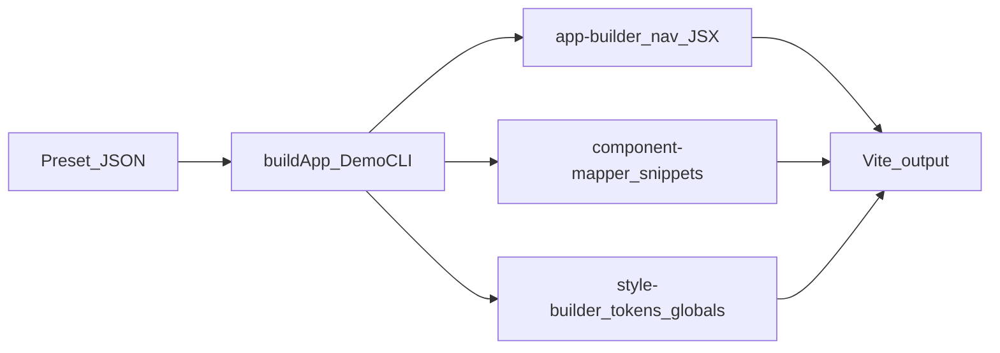

# Local (deterministic) generation — brainstorm and root causes

## How this relates to your test

With **AI support off**, [`DemoCLI/index.cjs`](DemoCLI/index.cjs) always runs the same deterministic path as the AI fallback: `buildApp` → scaffolder + [`app-builder.cjs`](DemoCLI/generators/project/app-builder.cjs) / [`page-builder.cjs`](DemoCLI/generators/project/page-builder.cjs) + [`component-mapper.cjs`](DemoCLI/generators/shared/component-mapper.cjs) + [`style-builder.cjs`](DemoCLI/generators/shared/style-builder.cjs). So every issue you listed is explainable from **static templates**, not model drift.

I could not read your preset folder from the sandbox (`C:\Users\Admin\.reactBitsExplorer\presets\...` was missing from the workspace view); the analysis below is from the repo’s generator code, which is what actually produces `adjacent`.

---

## 1 — Border radius feels “stuck at 0”

**Three separate mechanisms** can make corners square even when you clear “Corner radius” in the UI:

- **Brutalist global CSS** — In [`style-builder.cjs`](DemoCLI/generators/shared/style-builder.cjs), the `brutalist` aesthetic injects `*, *::before, *::after { border-radius: 0 !important; }`. That overrides **every** radius (including small radii baked into [`component-mapper.cjs`](DemoCLI/generators/shared/component-mapper.cjs) snippets, e.g. `Folder`’s inner `borderRadius: 4`, `AnimatedList` wrapper `12`, etc.).
- **Layout table per aesthetic** — [`page-builder.cjs`](DemoCLI/generators/project/page-builder.cjs) `LAYOUT_BY_AESTHETIC` sets `borderRadius: '0'` for **brutalist** and **futuristic** for generated buttons/hero chrome, independent of the Sizes tab.
- **“Empty” preset value ≠ generator default** — [`builderDefaults.ts`](src/features/project-builder/builderDefaults.ts) uses `borderRadius: ''` for “unset”. The CLI **does not** map that string to a tokenized radius scale in CSS; corner choices mostly live in per-section `layout.borderRadius` (from the first aesthetic) and in fixed numbers inside component JSX. So toggling the chip off does **not** automatically mean “use a sensible default token everywhere.”

**Brainstorm direction:** Decide product behavior: (A) Brutalist should keep global square enforcement but then the UI should warn that Sizes > Corner radius is ineffective; or (B) relax the global `!important` rule to only target buttons/layout primitives, not third-party component roots; (C) introduce `--radius-*` tokens from `designRules.sizes.borderRadius` (with `''` → aesthetic default) and use them in generated inline styles where feasible.

---

## 2 — White text on white background (PillNav + sections)

**PillNav (multi-page dynamic nav)** — [`buildNavJsxForPages`](DemoCLI/generators/project/app-builder.cjs) for `PillNav` only passes `logo` and `items`. The stock [`component-mapper.cjs`](DemoCLI/generators/shared/component-mapper.cjs) `PillNav` snippet *does* pass `baseColor="var(--color-text)"`, `pillColor="var(--color-surface)"`, `pillTextColor="var(--color-text)"`, `hoveredPillTextColor="var(--color-bg)"` — but **that snippet is not used** when `app-builder` builds real routes. The real `PillNav` component defaults (`baseColor` / pill text resolution in [`PillNav.tsx`](ReactBitsComponents/Components/PillNav/PillNav.tsx)) assume a **dark** chrome (e.g. default white label color). On a **light** `--color-bg`, nav labels can disappear.

**Embedded component overrides** — e.g. [`SpotlightCard` in `component-mapper.cjs`](DemoCLI/generators/shared/component-mapper.cjs) wraps content in `#f8fafc` / `#e2e8f0` text colors. On a light site background that is effectively invisible.

**Third-party CSS** — e.g. [`AnimatedList.css`](ReactBitsComponents/Components/AnimatedList/AnimatedList.css) hard-codes dark surfaces (`#170D27`) and `.item-text { color: white }`. That is fine inside each row, but gradients/scroll chrome assume a dark frame; combined with a very light `--color-surface` wrapper from the mapper, some edge cases can look “washed” depending on stacking. The bigger win is still **SpotlightCard + PillNav** for true white-on-white failures.

**Brainstorm direction:** (1) Align `buildNavJsxForPages('PillNav', …)` with the same CSS-variable props as the static mapper (and mirror in [`structure-generator.cjs`](DemoCLI/generators/project/structure-generator.cjs) if that path is still used). (2) Replace hardcoded light hexes in component snippets with `var(--color-text)` / `color-mix` / a small “inverse surface” pattern. (3) Optionally add a deterministic QA check (contrast on generated inline styles) for the no-AI path — you already run [`runQualityGates`](DemoCLI/index.cjs) without AI; extending gates for “hardcoded near-white text” would catch `SpotlightCard`.

---

## 3 — Logo / images vs Images tab and joker assets

- **PillNav logo** — Dynamic nav always uses the constant [`DEFAULT_LOGO_DATA_URI`](DemoCLI/generators/project/app-builder.cjs) (SVG with “BITFORGE” text). The **Images** tab (`designRules.images` in [`builderDefaults.ts`](src/features/project-builder/builderDefaults.ts)) is **not referenced** anywhere in `DemoCLI` generation (grep only hits synthetic local preset defaults). So “no uploads” does not fall back to jokers for the nav logo today.
- **Joker images** — [`scaffolder.cjs`](DemoCLI/generators/project/scaffolder.cjs) copies joker files to `public/`; [`FlowingMenu` in `app-builder`](DemoCLI/generators/project/app-builder.cjs) already uses `/joker-square.jpg` per item. **PillNav** never points at jokers for `logo`.
- **Why you might see garbled text (“tforge”)** — Most likely a **cropped / failed logo render** (layout + fixed nav width) or confusion with the SVG’s embedded “BITFORGE” wordmark vs your mental model of a brand mark; worth reproducing in the browser devtools (network tab for `data:image/svg+xml`, computed width on the ``). Less likely: a different code path (structure generator vs app-builder) — worth confirming which generator wrote `adjacent` (both define the same default SVG today).

**Brainstorm direction:** Define a small **image resolution order** for deterministic builds: first user `designRules.images[0]` (if any), else `/logo.svg` if present, else a **brand-derived** SVG data URI (from `clientBrief.brandName`), else `/joker-square.jpg` as raster fallback. Wire that helper into `PillNav`, `CardNav`, and any other `logo=` sites.

---

## 4 — Mental model: preset “unset” vs generator

| Your expectation | Current behavior (deterministic) |
|------------------|----------------------------------|
| Clear corner radius → soft defaults | Aesthetic + brutalist global CSS dominate; `''` is not mapped to a global radius token |
| Empty Images tab → still show placeholders | Jokers used only where JSX already references them; nav logo is a fixed SVG URI |
| Components respect light theme | Some snippets + default PillNav props assume dark UI |

*(Table for your notes — the deliverable plan uses bullets only per tool constraints.)*

---

## Suggested implementation order (when you leave plan mode)

1. **PillNav / CardNav parity** — Extend [`buildNavJsxForPages`](DemoCLI/generators/project/app-builder.cjs) (and [`structure-generator.cjs`](DemoCLI/generators/project/structure-generator.cjs) if needed) with the same `baseColor` / `pillColor` / text props as [`component-mapper.cjs`](DemoCLI/generators/shared/component-mapper.cjs).
2. **SpotlightCard (and any other `#f8fafc` snippets)** — Swap to theme variables or `color-mix(in srgb, var(--color-text) …)` so light/dark both work.
3. **Radius policy** — Either document brutalist as “always square” or narrow the `!important` selector scope; optionally map `designRules.sizes.borderRadius` from `''` to a default curve in [`page-builder.cjs`](DemoCLI/generators/project/page-builder.cjs) / tokens.
4. **Optional: `resolveLogo(designRules, clientBrief)`** — Single helper used by nav builders + brief output.

---

## Architecture sketch (data flow)

No AI step runs when `aiSupport` is false; all of the above is deterministic string composition from preset + brief.
